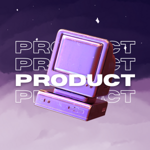
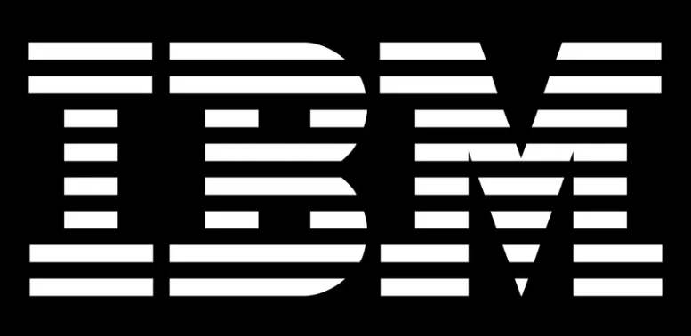
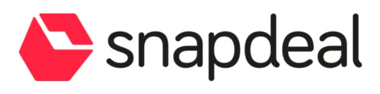
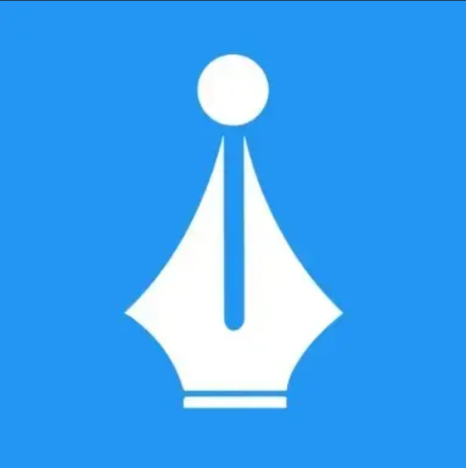

 

 

<h1>I Think in Systems. I Build in Products. I Write About Both.</h1>

I make sense of complex products. Whether it's building B2B experiences that actually scale, or helping teams navigate AI integration without losing sight of the user — that's where I add value.

Right now, I'm **Building B2B product experiences at IBM (from Q2'26)** and researching how AI reshapes the PM role (spoiler: it's not about replacing you, it's about elevating what you build). Previously, I've built and scaled products in competitive spaces like e-commerce, Web3, and ed-tech. I've been in the rooms where teams panic about pivots, data quality crises, and AI roadmap chaos, and I know how to navigate them.

 

 

---

### 🚀 **Experience & Impact**

_Building and scaling products in competitive spaces: E-commerce, Web3, Ed-tech & Enterprise AI._

Startups, Scale-ups, or Enterprise — I've seen the lifecycle.

   &nbsp;&nbsp;&nbsp;&nbsp;
   &nbsp;&nbsp;&nbsp;&nbsp;
   &nbsp;&nbsp;&nbsp;&nbsp;
   &nbsp;&nbsp;&nbsp;&nbsp;
  

---

### 🛠️ **The Arsenal (Tech & Product Stack)**

_A Senior Product Manager's toolkit needs to differ from the crowd. Deeply technical, AI-native, and strategy-focused._

**Product Strategy & Ops**

**AI & Research Intelligence**

**Data, Engineering & Automation**

---

### 📰 **Featured Writing: The Product Newsletter**

> **1000+ Product Managers** subscribe for unfiltered, grounded thinking on Product, AI, and Strategy.
>
> _I write about Product strategy that sticks, AI in realistic terms (not hype), and how behavioral science actually changes user decisions._

---

### 🤝 **Collaboration**

_How to get my attention:_

1.  Bring a **product problem** that hasn't been solved.
2.  Collaborate on **deep-dive research**.
3.  Build something together at a **hackathon** (20+ wins & counting).
4.  Share a **case study** that actually challenged conventional wisdom.

For collaboration inquiries, newsletter growth partnerships, or research discussions:
📧 **[mail.gyaneshsamanta@gmail.com](mailto:mail.gyaneshsamanta@gmail.com)**

